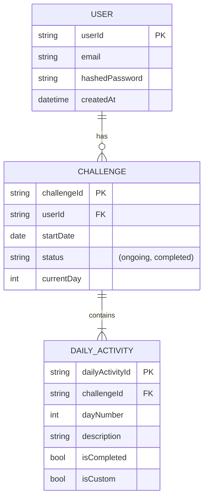

# Data Model Specification

This document defines the core data entities for the 21-Day Self-Love Challenge App, based on the feature specification.

## Entity Relationship Diagram (ERD) - Conceptual

## Entity Definitions

### 1. User

Represents an authenticated user of the application.

- **`userId`** (string, Primary Key): A unique identifier for the user (e.g., UUID).
- **`email`** (string): The user's email address, used for login.
- **`hashedPassword`** (string): The user's hashed password for authentication.
- **`createdAt`** (datetime): Timestamp of when the user account was created.

### 2. Challenge

Represents a single 21-day challenge instance for a specific user.

- **`challengeId`** (string, Primary Key): A unique identifier for this challenge instance.
- **`userId`** (string, Foreign Key): Links to the `User` who owns this challenge.
- **`startDate`** (date): The date the user started the challenge.
- **`status`** (string): The current status of the challenge. Can be `ongoing` or `completed`.
- **`currentDay`** (integer): The current day number (1-21) the user is on in their self-paced journey.

### 3. DailyActivity

Represents a single activity item for a specific day within a user's challenge.

- **`dailyActivityId`** (string, Primary Key): A unique identifier for the activity record.
- **`challengeId`** (string, Foreign Key): Links to the `Challenge` this activity belongs to.
- **`dayNumber`** (integer): The day (1-21) this activity is for.
- **`description`** (string): The text of the activity (e.g., "Write down three things you are grateful for").
- **`isCompleted`** (boolean): `true` if the user has marked this activity as done, otherwise `false`. Default: `false`.
- **`isCustom`** (boolean): `true` if this activity was written or edited by the user, otherwise `false`. Default: `false`.

## State Transitions

- **Challenge Status**: A `Challenge`'s `status` transitions from `ongoing` to `completed` only after the user completes all activities for `currentDay` = 21.
- **Activity Status**: A `DailyActivity`'s `isCompleted` status can only transition from `false` to `true`. It cannot be undone.
